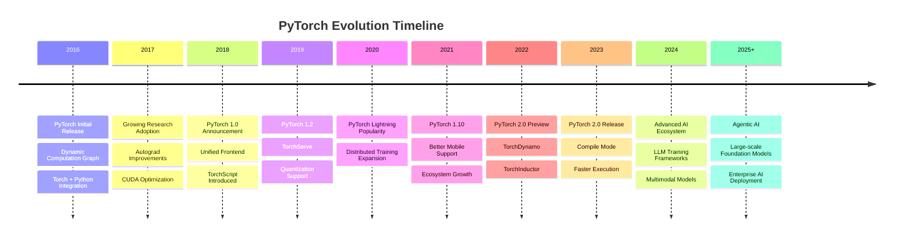

```mermaid
graph TD

    PT[PyTorch]

    PT --> CV[Computer Vision]
    PT --> NLP[Natural Language Processing]
    PT --> GNN[Graph Neural Networks]
    PT --> RL[Reinforcement Learning]
    PT --> LLM[Large Language Models]
    PT --> MLOPS[MLOps]

    CV --> TV[TorchVision]
    CV --> DET[Detectron2]
    CV --> MMDET[MMDetection]

    NLP --> HF[Transformers]
    NLP --> FS[Fairseq]
    NLP --> SB[Sentence Transformers]

    GNN --> PYG[PyTorch Geometric]
    GNN --> DGL[Deep Graph Library]

    RL --> TRL[TorchRL]
    RL --> SB3[Stable Baselines3]

    LLM --> HF2[HuggingFace]
    LLM --> PEFT[PEFT]
    LLM --> TRL2[Transformer RLHF]
    LLM --> DeepSpeed
    LLM --> MegatronLM

    MLOPS --> Lightning[Lightning AI]
    MLOPS --> MLflow
    MLOPS --> WeightsBiases
    MLOPS --> Kubeflow
```

<div align="center">
    <p align="center">
        <a href="https://wikipedia.org/wiki/PyTorch">
          
        </a>
    </p>



# **`Awesome`** [PyTorch](https://pytorch.org/) [](https://awesome.re)
</div>

[]()
[](https://www.reddit.com/r/pytorch/new/)

<p align="center">
    <a href="https://github.com/cybersecurity-dev/"></a>
    &nbsp;
    <a href="https://www.youtube.com/@CyberThreatDefence"></a>
    &nbsp;
    <a href="https://cyberthreatdefence.com/my_awesome_lists"></a>
    
</p>



## 📖 Contents
- [Installation Steps](#installation-steps)
- [My Awesome Lists](#my-awesome-lists)
- [Contributing](#contributing)
- [Contributors](#contributors)

---
---

## Installation Steps

* Linux
    * CPU
        ```bash
        pip3 install torch torchvision --index-url https://download.pytorch.org/whl/cpu
        ```
    * GPU
        ```bash
        pip3 install torch torchvision --index-url https://download.pytorch.org/whl/cu130
        ```
* Windows
  * CPU
      ```powershell
      pip3 install torch torchvision
      ```
  * GPU
      ```powershell
      pip3 install torch torchvision --index-url https://download.pytorch.org/whl/cu130
      ```
Test
```shell
python -c "import torch; print(torch.__version__)"
```

##

### My Awesome Lists
You can access the my awesome lists [here](https://cyberthreatdefence.com/my_awesome_lists)

### Contributing
[Contributions of any kind welcome, just follow the guidelines](contributing.md)!

### Contributors
[Thanks goes to these contributors](https://github.com/cybersecurity-dev/awesome-pytorch/graphs/contributors)!

[🔼 Back to top](#awesome-pytorch-)
